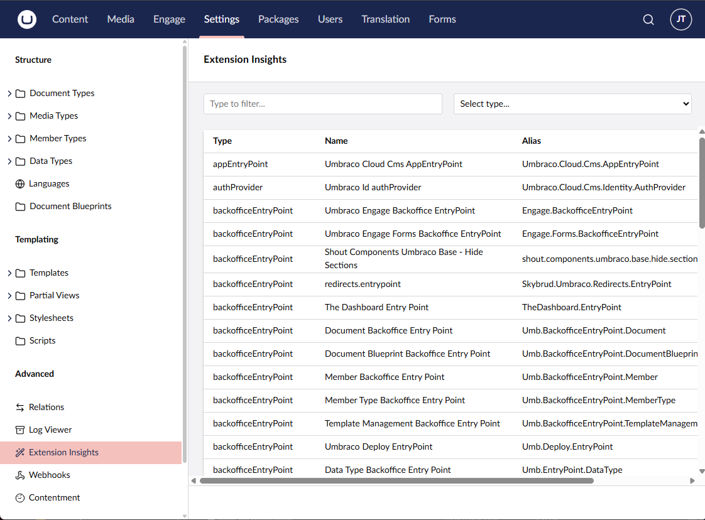

## Umbraco Packages & Extensions - [Examples](./examples.md)

### What's changed

Quite a lot! Enough for its own talk, but I have gone through quite a bit and have included examples which you may find useful. Everything I've talked about so far could be in one-way or another related to your Umbraco Packages / Extensions plus much more.
Where most extensions could be done via C# previously - the vast amount now require client-side Web Components, the learning curve is quite steep in this sense, but you soon get used to it.
I recommend running the V13 site side-by-side so you can compare, then work through one issue at a time, most likely you'll start with registering the package/extension via a manifest file.

### Manifest

There are a couple of ways you can do this, the documentation recommends creating a `umbraco-package.json` file with the contents of the manifest. I've included examples [here](./examples.md)
The alternative option, which is actually my preferred way is via C# by implementing `IPackageManifestReader` - there isn't much documentation around this and I actually found out it was possible by chance whilst debugging something else. You can see an example `IPackageManifestReader` [here](../Deprecated%20Property%20Editors/MigrationExample/ManifestReader.cs) and [here](./examples.md).

I prefer the C# approach as it aligns more to how it worked in V13 but also allows me to dynamically set the version number.

One manifest file can be used to define one-to-many extensions, a full list of available extensions can be found here: https://docs.umbraco.com/umbraco-cms/customizing/extending-overview/extension-types#full-list-of-extension-types

### Validate extensions

There is now a new section in Umbraco which allows you to view all `extensions` which are registered, which is useful if you're not sure if the extension is registered or if you're not sure what `extension` to use, you can look at the OOTB extensions for comparison. 

## Full Example

I have created a complete end-to-end example which may be useful, that covers quite a lot in such a small package.
- Defines a package with a manifest
- A Management API Controller which returns some appsettings as JSON
- A client-side Web Component, which generates a Bearer token and then calls the Management API method
- Depending on the JSON returned, client-side code is executed which hides `Sections` and `Dashboards`