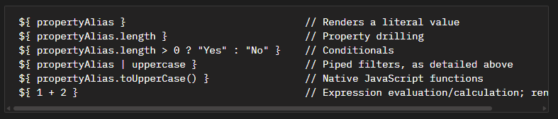

## Umbraco Flavored Markdown

### Find all instances of legacy AngularJS labels that need fixing

```sql
select un.text as [Name], udt.* from umbracoDataType udt
inner join umbracoNode un on un.id = udt.nodeId
where udt.config like '%{}%'
```

### Simple example:

```
{{title}}
```

Would now be:
```
{umbValue:title}
```

Or, shorthand you can do

```
{=title} 
```

The `umbValue` part is called a `UFM Component`, there are a few that are included OOTB such as

| Component    | Use |
| -------- | ------- |
| umbValue  | Renders the value of a property    |
| umbContentName | Renders the name(s) of the picked content, comma separated     |
| umbLink    | Renders the title of a picked link   |
| umbLocalize    | Renders a localized dictionary string    |

### More Examples



Another feature similar to AngularJS is the inclusion of a pipe `|`
These are called `UFM Filters` - you can find a full list on the documentation page, but in the example above you can see the value is converted to uppercase.

Of course, with all things Umbraco you can roll your own `UFM Components` and `UFM Filters`.

We ran into this with a client, see this more complicated example.

```
{{manufacturer[0] | getValueFromStringJson : 'Name'}} ({{excludeAllElectricVehicles == 1 && electricModels.length == 0 ? 'Exclude Ev Models': electricModels.length > 0 ? electricModels.length + ' EV Models Selected': 'All EV Models Selected'}}, {{excludeAllHybridVehicles == 1 && hybridModels.length == 0 ? 'Exclude Hybrid Models': hybridModels.length > 0 ? hybridModels.length + ' Hybrid Models Selected': 'All Hybrid Models Selected'}})
```

If we take the first part:

```
{{manufacturer[0] | getValueFromStringJson : 'Name'}}
```

This takes an array of `Manufacturers` which are essentially block list items - takes the first item and uses a pipe/filter `getValueFromStringJson` to get a property called `Name`.

Now this may be possible by using Native JavaScript functions as shown in the example above, however we wanted to make this easier by creating our own `UFM Filter` - (I've included the source code for this).

With the new `UFM Filter` installed - the new label value is:

```
${ manufacturer | parseJsonValue:0:Name }
```

Full label:

```
${ manufacturer | parseJsonValue:0:Name } (${ excludeAllElectricVehicles == 1 && electricModels.length == 0 ? 'Exclude Ev Models' : electricModels.length > 0 ? electricModels.length + ' EV Models Selected' : 'All EV Models Selected' }, ${ excludeAllHybridVehicles == 1 && hybridModels.length == 0 ? 'Exclude Hybrid Models' : hybridModels.length > 0 ? hybridModels.length + ' Hybrid Models Selected' : 'All Hybrid Models Selected' })
```