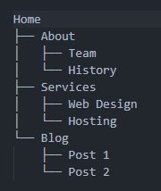

## Hyrbid Cache - Always cache content types

```json
"Umbraco": {
  "CMS": {
    "Cache": {
      "ContentTypeKeys": ["e811405e-0190-4d3e-8387-7558521eec81", "419e89fb-8cff-4549-a074-9f8a30687828", "e0d71146-8205-4cf4-8236-f982b392259f"],
    }
  }
}
```

### Breadth-first

Is a tree traversal strategy — it means "go wide before going deep."

Imagine your Umbraco content tree:




Breadth-first traversal processes it level by level:

`Home` (level 1)

`About`, `Services`, `Blog` (level 2)

`Team`, `History`, `Web Design`, `Hosting`, `Post 1`, `Post 2` (level 3)

Depth-first (the alternative) would dive all the way down one branch first:

Home → About → Team → History → Services → ...


Why it matters for the BreadthFirstKeyProvider:
When seeding N items (say N=4), breadth-first gives you the most representative spread of your content tree — you'd get Home, About, Services, Blog rather than just Home + all of About's descendants.
This makes sense for a key provider seeding cache/search indexes, because you want coverage across the whole site rather than exhaustively indexing one deep branch while ignoring others entirely. It's a sensible default for warming up content in a balanced way.

### Get Descendants

Previous:

```csharp
var rootPage = _publishedContentCache.GetById(false, rootId);
var descendants = rootPage.Descendants();
```

New:

```csharp
var rootPage = _publishedContentCache.GetById(rootId);
var descendants = rootPage.Descendants(
    _documentNavigationQueryService,
    _publishedStatusFilteringService);

```


### Get Descendant of type

Previous:

```csharp
var rootPage = _publishedContentCache.GetById(false, rootId);
var siteSettings = rootPage.DescendantOfType(siteSettingsAlias);
```

New:

```csharp
var rootPage = _publishedContentCache.GetById(rootId);
var siteSettings = rootPage.DescendantOfType(
    _documentNavigationQueryService,
    _publishedStatusFilteringService,
    siteSettingsAlias);

```

You'll notice the addition of:

`INavigationQueryService` and `IPublishedStatusFilteringService`

In this instance we want to query content so we've used `IDocumentNavigationQueryService` but if we wanted to deal with media we can use `IMediaNavigationQueryService`

`INavigationQueryService` - owns the tree structure, who is the parent of what, what are the children of a given node, descendants etc. But it only deals in GUIDs, not full content objects which makes it pretty efficient. 

`IPublishedStatusFilteringService` - This answers the question *'Should this node be included in the results given the current context'*.